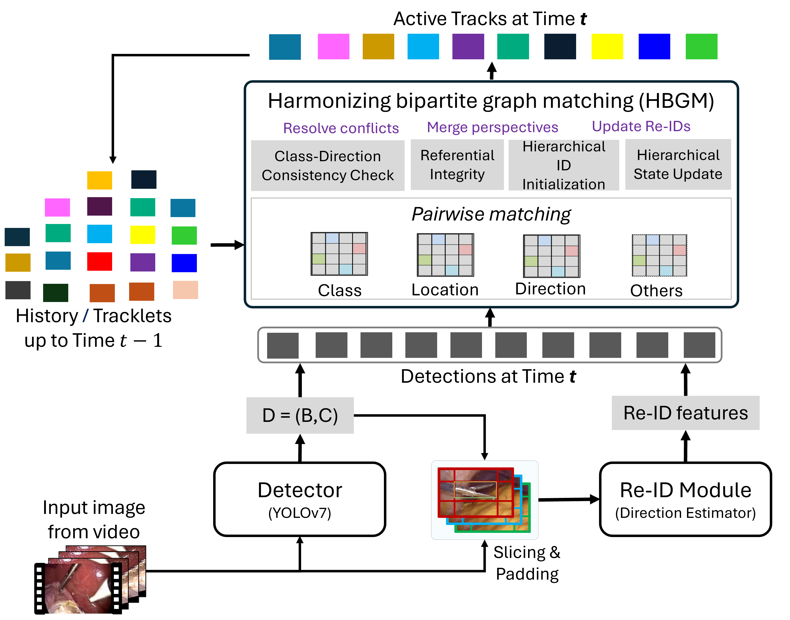

# Surgical Text-to-Image Generation

  

 
    <b style="color:blue">Abstract:</b>
    Accurate tool tracking is essential for the success of computer-assisted intervention. Previous efforts often modeled tool trajectories rigidly, overlooking the dynamic nature of surgical procedures, especially tracking scenarios like out-of-body and out-of-camera views. Addressing this limitation, the new CholecTrack20 dataset provides detailed labels that account for multiple tool trajectories in three perspectives: (1) intraoperative, (2) intracorporeal, and (3) visibility, representing the different types of temporal duration of tool tracks. These fine-grained labels enhance tracking flexibility but also increase the task complexity. Re-identifying tools after occlusion or re-insertion into the body remains challenging due to high visual similarity, especially among tools of the same category. This work recognizes the critical role of the tool operators in distinguishing tool track instances, especially those belonging to the same tool category. The operators’ information are however not explicitly captured in surgical videos. We therefore propose SurgiTrack, a novel deep learning method that leverages YOLOv7 for precise tool detection and employs an attention mechanism to model the originating direction of the tools, as a proxy to their operators, for tool re-identification. To handle diverse tool trajectory perspectives, SurgiTrack employs a harmonizing bipartite matching graph, minimizing conflicts and ensuring accurate tool identity association. Experimental results on CholecTrack20 demonstrate SurgiTrack’s effectiveness, outperforming baselines and state-of-the-art methods with real-time inference capability. This work sets a new standard in surgical tool tracking, providing dynamic trajectories for more adaptable and precise assistance in minimally invasive surgeries.

  
>>>>> <a href="https://arxiv.org/abs/2405.20333" target="_blank" class="external-link button is-normal is-rounded is-dark">  <i class="ai ai-arxiv"></i> 📰 arXiv Preprint </a>
>>>>> <a href="https://www.sciencedirect.com/science/article/pii/S1361841524003633#mmc1" target="_blank" class="external-link button is-normal is-rounded is-dark">  <i class="ai ai-arxiv"></i> 📰 Medical Image Analysis Journal </a>

 

### CItation
-------------
<pre><code>@article{nwoye2024surgitrack,
  title={SurgiTrack: Fine-grained multi-class multi-tool tracking in surgical videos},
  author={Nwoye, Chinedu and Padoy, Nicolas},
  journal={Medical Image Analysis},
  pages={103438},
  year={2024},
  publisher={Elsevier}
}</code></pre>

 

Coming soon !

